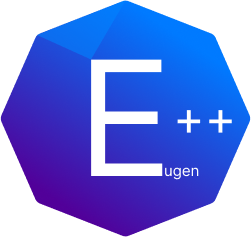

<h1>The Eugen++ Programming Language</h1>

A general-purpose programming language, focused on simplicity.

<h2>How to run</h2>
<h4>Download the <a href="https://github.com/eugenlukas/EugenPlusPlus/releases">latest</a> Eugen++ installer or Eugen++ directly and install/save it</h4>

<h3>Compile file</h3>
<h6>.\Eugen++.exe can vary depending on where Eugen++.exe is located in storage</h6>

~~~
 .\Eugen++.exe F:\EugenPlusPlusTestFile.epp 
 ~~~

 <h3>(Possible) arguments to pass through the exe</h3>

 ~~~
 filepath		-run file directly (must be at the first position)
 --tokens		-shows all tokens
 --ast			-shows abstract syntax tree
 --dumpIR       -dumps the generated IR to console
 --o            -only make object file without linking
 ~~~

<h2>Syntax</h2>
<h4>Read the <a href="https://eugenlukas.de/pages/EugenPlusPlus_Documentation/docs/intro">official documentation</a>.</h4>

<h2>Dpendencies to use</h2>
<ul>
<li>g++/clang++</li>
</ul>

<h2>How to build the compiler</h2>
<h3>Example on Arch Linux with git</h3>

~~~
git clone https://github.com/eugenlukas/EugenPlusPlus.git
cd EugenPlusPlus
mkdir out
cd out
cmake ..
make
~~~

<h3>Dpendencies to build</h3>
<ul>
<li>cmake</li>
<li>g++</li>
<li>llvm</li>
</ul>